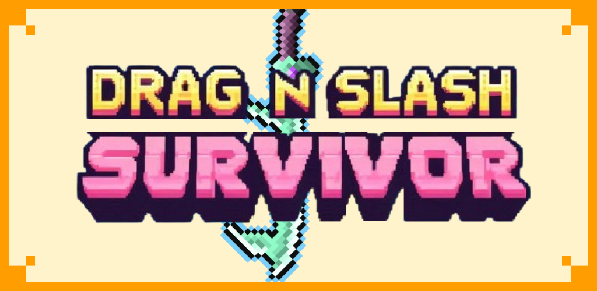

🇺🇸 English | 🇰🇷 [한국어](README_KR.md)

  <h2>🎮Drag&Slash Survivor v1.1.2</h2>
  

---

## 📌 Table of Contents  

- [Overview](#overview)  
- [Game Description](#game-description)  
- [Game Features](#game-features)  
- [Controls](#controls)  
- [Screenshots & Gameplay Video](#screenshots--gameplay-video)  
- [Tech Stack](#tech-stack)  
- [Download & Play](#download--play)
- [Updates](#updates)  
- [Credits](#credits)  
- [Assets](#assets)

---

## 🧩 Overview

- **Project Name**: Drag & Slash Survivor  
- **Development Period**: Feb 2025 – Apr 2025  
- **Engine**: Unity6  
- **Language**: C#  
- **Team**: 3 members (2 Game Designers, 1 Programmer)

---

## 🕹️ Game Description

**Drag & Slash Survivor** is a **2D mobile hybrid casual survivor-like game** developed with **Unity 6**.

Players combine various **skills and weapons** and use their **finger to drag attacks across the battlefield**, defeating waves of enemies and ultimately challenging the final boss.

**Drag & Slash Survivor** currently **does not collect, store, or share any personal data.**  
The game is a fully **offline experience with no ads, login system, or server communication.**

※ If advertising features are added in future updates, this policy may change.  
Contact: **deccj97@gmail.com**

---

## ⭐ Game Features

| Feature | Description |
|------|------|
| 👆 Your Finger is the Weapon | Your finger becomes the weapon! Drag your weapon across the battlefield to wipe out large waves of enemies. |
| ⚔️ Diverse Skill System | Customize your playstyle by choosing from a variety of skills and weapon traits focused on offense or defense. |
| 🕹️ Short Play Sessions | Designed for casual gameplay with short play sessions of about **2–3 minutes**. |

---

## 🎮 Controls

| Action | Input |
|------|----|
| Move | Touch |
| Attack | Touch & Drag |

---

## 🖼️ Screenshots & ▶️ Gameplay Video

### Screenshots

|  |  |  |
|:--:|:--:|:--:|
| In-game Combat | Skill Selection | Boss Battle |

### Gameplay Video

> ✨ https://www.youtube.com/watch?v=77Aoty-M29Y

---

## 🛠️ Tech Stack

- **Unity Engine**: Animator, Scene management, UI system, SerializedDictionary, etc.  
- **C#**: Object pooling, CSV read/write, combat system, UI logic, monster AI, skill systems  
- **Git**: Version control & collaboration  
- **Figma**: UI design and sprite creation  

---

## 🚀 Download & Play

### A. Google Play Store

> ✨ https://play.google.com/store/apps/details?id=com.teamfunity.dragnslashsurvivor

### B. Play on Web

> 🌐 https://taupe-rolypoly-666d14.netlify.app/

---

## 🔄 Updates

- Improved performance optimization for mobile devices  
- Enhanced compatibility with **Android 15 and Vulkan-based systems**  
- Improved memory efficiency  
- Reduced loading times  

---

## 🙌 Credits

- **Game Design**: Man Jun Han, Minseok Seo  
- **Programming**: CheonHyeok Moon  
- **Team Name**: Team Funity  

---

## 📚 Assets  

For the full list of asset sources, please refer to **[ASSETS.md](./ASSETS.md)**.

---

Thank you for playing!  
Enjoy the game 🎮

